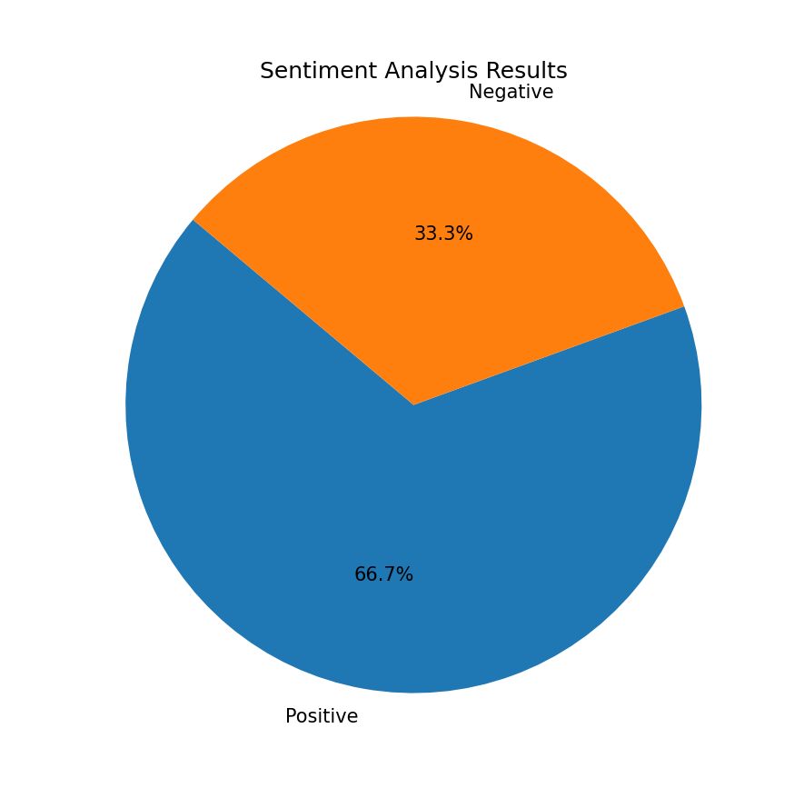

# 🧠 Sentiment Analyzer (Local Version)

This is a simple but effective Python project that performs sentiment analysis on a set of text inputs using [VADER](https://github.com/cjhutto/vaderSentiment) from the `nltk` library.

It classifies each text as **Positive**, **Negative**, or **Neutral**, and visualizes the results in a pie chart.

---

## 📌 Features

- Read input texts from a `.csv` file
- Perform sentiment classification using VADER (compound score)
- Display a summary chart of sentiment distribution
- Export results to a new `.csv` file

---

## 📷 Preview

> _Add your screenshot below this line:_



---

## 🛠️ Technologies Used

- Python 3
- `pandas` – for data manipulation
- `nltk` – for natural language processing (VADER)
- `matplotlib` – for visualizing the results

---

## 📦 Installation

Install the required dependencies:

```bash
pip install pandas nltk matplotlib
